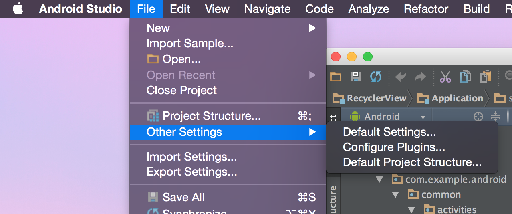
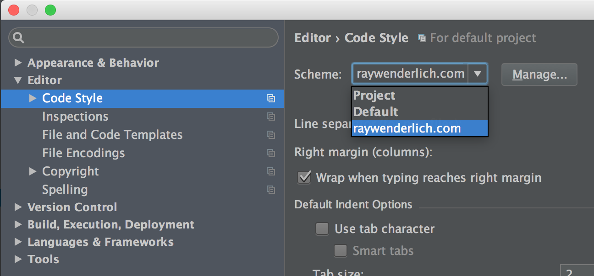

# The Official raywenderlich.com Java Style Guide

(Courtesy: [Ray Wenderlich](https://github.com/raywenderlich/java-style-guide))

This style guide is different from other you may see, because the focus is
centered on readability for print and the web. We created this style guide to
keep the code in our tutorials consistent.

Our overarching goals are __conciseness__, __readability__ and __simplicity__.

## Inspiration

This style-guide is somewhat of a mash-up between the existing Java language
style guides, and a tutorial-readability focused Swift style-guide. The language
guidance is drawn from the
[Android contributors style guide](https://source.android.com/source/code-style.html)
and the
[Google Java Style Guide](https://google-styleguide.googlecode.com/svn/trunk/javaguide.html).

## Android Studio Coding Style

It is possible to get Android Studio to adhere to these style guidelines, via
a rather complex sequence of menus. To make it easier, we've provided a coding
style that can be imported into Android Studio.

First, clone this repository and run `install.sh`.

Then, open Android Studio. To set this codestyle as the default, select
__File > Other Settings > Default Settings...__:

In __Editor > Code Style__, choose the __Scheme__ to be __raywenderlich.com__:

From now on, projects you create _should_ follow the correct style guidelines.

## Table of Contents

- [Nomenclature](sections/Nomenclature.md)
- [Declarations](sections/Declarations.md)
- [Spacing](sections/Spacing.md)
- [Getters & Setters](sections/GettersSetters.md)
- [Brace Style](sections/BraceStyle.md)
- [Switch Statements](sections/SwitchStatements.md)
- [Annotations](sections/Annotations.md)
- [XML Guidance](sections/XMLGuidance.md)
- [Language](sections/Language.md)
- [Copyright Statement](sections/CopyrightStatement.md)
- [Credit](sections/Credits.md)

